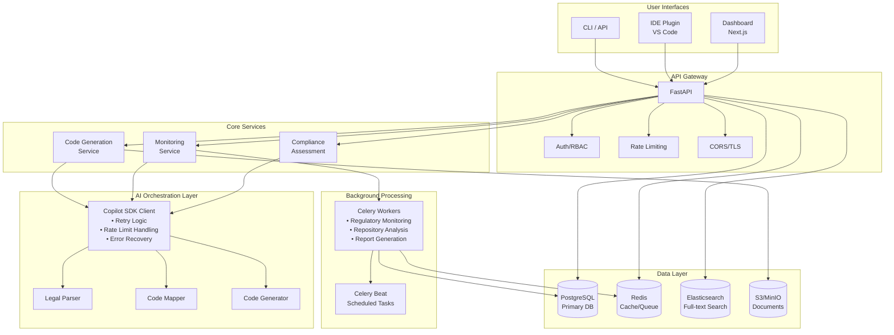
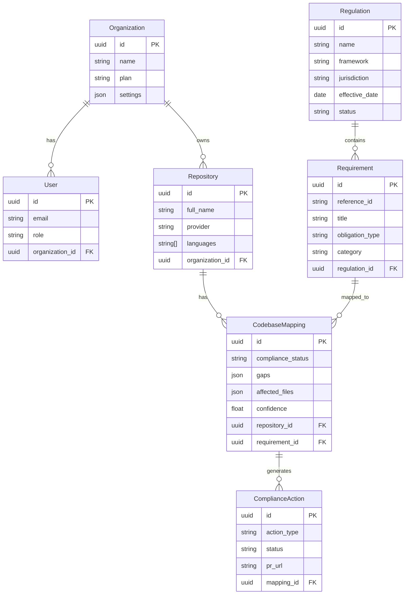
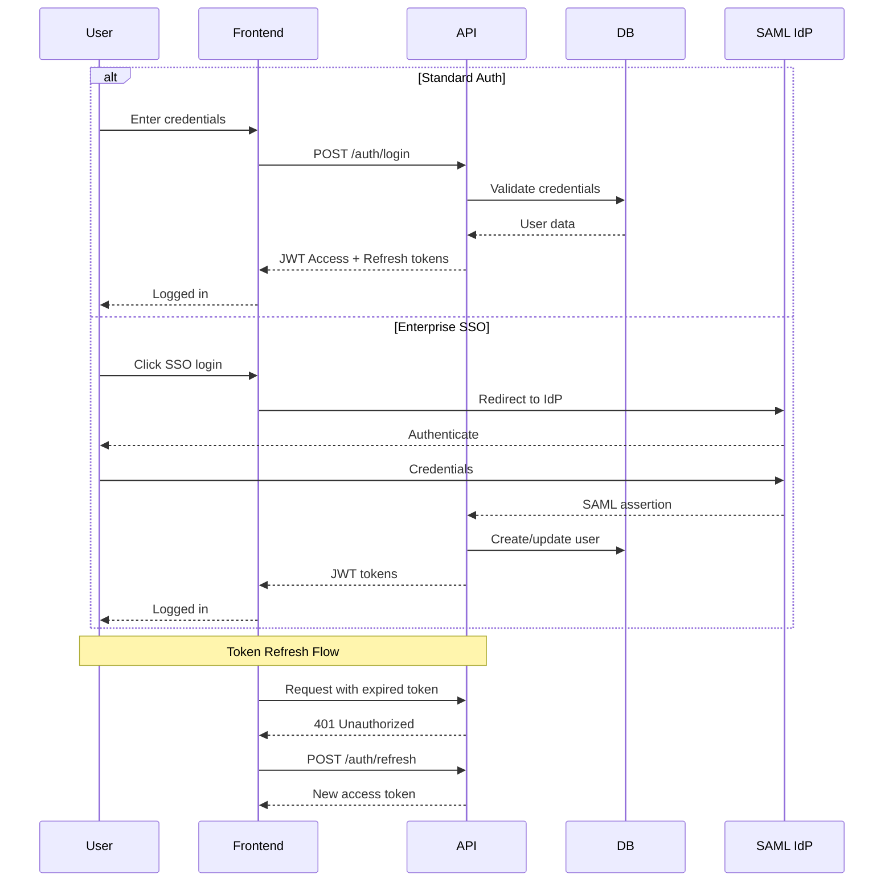
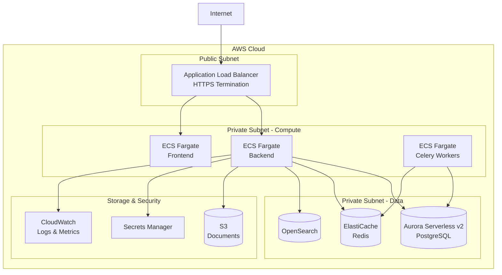

# ComplianceAgent Architecture Overview

This document describes the high-level architecture of ComplianceAgent and the key decisions behind it.

## System Overview

ComplianceAgent is an AI-powered platform that automates regulatory compliance for software development teams. It monitors regulatory changes, maps them to codebases, and generates compliant code modifications.



## Core Components

### 1. API Layer (FastAPI)

**Location:** `backend/app/api/`

FastAPI was chosen for:
- Native async/await support (critical for I/O-bound compliance operations)
- Automatic OpenAPI documentation
- Pydantic integration for request/response validation
- High performance benchmarks

The API is versioned (`/api/v1/`) to support backward compatibility as the product evolves.

### 2. AI Orchestration Layer

**Location:** `backend/app/agents/`

This layer coordinates AI-powered operations through the GitHub Copilot SDK:

```python
# Simplified flow
async def process_regulatory_change(regulation, content):
    # 1. Extract requirements from legal text
    requirements = await copilot.analyze_legal_text(content)
    
    # 2. Map requirements to codebase
    mappings = await copilot.map_requirement_to_code(requirements, repo)
    
    # 3. Generate compliant code for gaps
    fixes = await copilot.generate_compliant_code(mappings.gaps)
    
    return fixes
```

**Key Design Decisions:**
- **Retry with exponential backoff**: AI API calls can fail transiently; we use tenacity for resilience
- **Configurable timeouts**: Large regulatory documents may take longer to process
- **Structured error handling**: Domain-specific exceptions (CopilotParsingError, etc.) for better debugging

### 3. Service Layer

**Location:** `backend/app/services/`

Services encapsulate business logic and are organized by domain:

| Service | Responsibility |
|---------|---------------|
| `monitoring/` | Crawl regulatory sources, detect changes |
| `parsing/` | Extract structured data from legal text |
| `mapping/` | Map requirements to code locations |
| `generation/` | Generate compliant code modifications |
| `audit/` | Maintain tamper-proof audit trail |
| `github/` | GitHub API integration |
| `enterprise/` | SSO/SAML authentication |
| `billing/` | Stripe subscription management |

### 4. Data Layer

**Models:** `backend/app/models/`
**Schemas:** `backend/app/schemas/`

We use SQLAlchemy 2.0 with async support:

```python
# Example: Async query with proper session handling
async with db.begin():
    result = await db.execute(
        select(Requirement)
        .where(Requirement.regulation_id == regulation_id)
        .options(selectinload(Requirement.mappings))
    )
    return result.scalars().all()
```

### 5. Background Processing

**Location:** `backend/app/workers/`

Celery handles:
- **Scheduled monitoring**: Check regulatory sources every 6 hours
- **Async analysis**: Repository scans that may take minutes
- **Bulk operations**: Processing multiple requirements in parallel

Redis serves as both message broker and result backend.

## Data Model



## Security Architecture

### Authentication Flow



### Multi-Tenancy

All data is isolated by `organization_id`:
- Every query includes organization filter
- Row-level security enforced at service layer
- API endpoints validate organization membership

### Secrets Management

| Environment | Strategy |
|-------------|----------|
| Development | `.env` file (gitignored) |
| Production | AWS Secrets Manager |

Sensitive values:
- Database credentials
- GitHub App private key
- Copilot API key
- Stripe API key

## Deployment Architecture

### Development

```bash
# Start all services locally
docker compose up -d postgres redis elasticsearch minio
cd backend && uvicorn app.main:app --reload
cd frontend && npm run dev
```

### Production (AWS)



Key decisions:
- **Aurora Serverless**: Scales to zero during inactivity, cost-effective
- **ECS Fargate**: No server management, auto-scaling
- **ElastiCache**: Managed Redis with automatic failover

## Design Decisions Log

### ADR-001: Why FastAPI over Django?

**Context:** Need async support for AI API calls and external integrations.

**Decision:** Use FastAPI.

**Rationale:**
- Native async/await (Django async is still maturing)
- Better performance for I/O-bound workloads
- Automatic OpenAPI documentation
- Pydantic integration matches our validation needs

**Trade-offs:**
- Smaller ecosystem than Django
- No built-in admin panel (acceptable for B2B SaaS)

---

### ADR-002: Why Celery over alternatives?

**Context:** Need background job processing for monitoring and analysis.

**Decision:** Use Celery with Redis.

**Alternatives considered:**
- `arq`: Simpler but less mature
- `dramatiq`: Good but smaller community
- AWS SQS + Lambda: Vendor lock-in

**Rationale:**
- Battle-tested in production
- Excellent monitoring (Flower)
- Celery Beat for scheduled tasks
- Large community and documentation

---

### ADR-003: Why GitHub Copilot SDK for AI?

**Context:** Need AI for legal text parsing and code generation.

**Decision:** Use GitHub Copilot SDK.

**Rationale:**
- Deep code understanding (trained on code)
- GitHub ecosystem integration
- Enterprise-grade reliability
- Compliance with data handling requirements

**Trade-offs:**
- Dependency on external service
- Usage-based pricing

**Mitigation:**
- Retry logic with exponential backoff
- Graceful degradation when unavailable
- Caching of parsed requirements

---

### ADR-004: Why PostgreSQL over other databases?

**Context:** Need relational database for multi-tenant SaaS.

**Decision:** PostgreSQL 16.

**Rationale:**
- JSONB for flexible schema (gaps, metadata)
- Excellent async driver (asyncpg)
- Aurora Serverless compatibility
- Strong consistency guarantees

---

### ADR-005: Audit Trail Design

**Context:** Compliance platform requires tamper-proof audit logs.

**Decision:** Hash chain verification.

**Implementation:**
```python
# Each entry includes hash of previous entry
new_entry.hash = sha256(previous_entry.hash + entry_data)
```

**Rationale:**
- Detects any modification to historical records
- No external dependencies (blockchain)
- Simple to verify and export

---

## Performance Considerations

### Bottlenecks and Mitigations

| Bottleneck | Mitigation |
|------------|------------|
| Copilot API latency | Async processing, retry logic |
| Large repository scans | Incremental analysis, caching |
| Database queries | Indexes, query optimization, read replicas |
| Regulatory document parsing | Background processing, chunking |

### Scaling Strategy

1. **Horizontal scaling**: ECS auto-scaling based on CPU/memory
2. **Database scaling**: Aurora read replicas, connection pooling
3. **Cache scaling**: Redis cluster mode for high throughput
4. **Background processing**: Multiple Celery workers with concurrency

## Monitoring and Observability

### Metrics (Future)

- Request latency (p50, p95, p99)
- Copilot API success rate
- Background job queue depth
- Compliance score trends

### Logging

Structured logging with `structlog`:
```python
logger.info(
    "requirement_extracted",
    regulation_id=str(regulation.id),
    count=len(requirements),
    confidence=avg_confidence,
)
```

### Tracing (Planned)

OpenTelemetry integration for distributed tracing across:
- API requests
- Celery tasks
- External API calls

---

## Future Considerations

1. **Multi-region deployment**: For data residency requirements
2. **GraphQL API**: For flexible frontend queries
3. **Plugin system**: Custom regulatory framework support
4. **ML model fine-tuning**: Improve extraction accuracy over time
