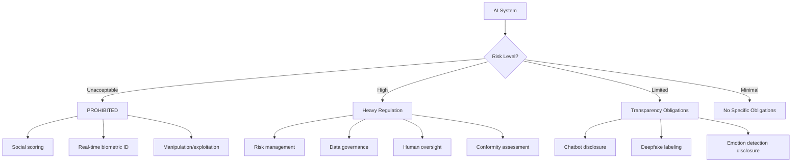

# EU AI Act Compliance Guide

This guide covers how ComplianceAgent helps you achieve compliance with the European Union Artificial Intelligence Act.

## Overview

| Attribute | Value |
|-----------|-------|
| **Full Name** | Regulation on Artificial Intelligence (AI Act) |
| **Jurisdiction** | European Union |
| **Effective Date** | August 2024 (phased implementation through 2027) |
| **Enforcing Authority** | National competent authorities, AI Office |
| **Max Penalty** | €35M or 7% of global annual turnover |

### Implementation Timeline

| Date | Milestone |
|------|-----------|
| Aug 2024 | Entry into force |
| Feb 2025 | Prohibited AI practices banned |
| Aug 2025 | GPAI model obligations apply |
| Aug 2026 | High-risk AI system requirements |
| Aug 2027 | Full implementation for certain products |

## Risk-Based Classification

### AI System Risk Levels



### High-Risk Categories (Annex III)

```python
class HighRiskAICategory(Enum):
    """EU AI Act Annex III high-risk AI systems."""
    
    # Biometric identification
    BIOMETRIC_IDENTIFICATION = "biometric_id"
    BIOMETRIC_CATEGORIZATION = "biometric_categorization"
    EMOTION_RECOGNITION = "emotion_recognition"
    
    # Critical infrastructure
    CRITICAL_INFRASTRUCTURE = "critical_infrastructure"
    
    # Education and vocational training
    EDUCATION_ACCESS = "education_access"
    EDUCATION_ASSESSMENT = "education_assessment"
    
    # Employment
    RECRUITMENT = "recruitment"
    HR_DECISIONS = "hr_decisions"
    WORKER_MONITORING = "worker_monitoring"
    
    # Access to essential services
    CREDIT_SCORING = "credit_scoring"
    INSURANCE_PRICING = "insurance_pricing"
    EMERGENCY_SERVICES = "emergency_services"
    
    # Law enforcement
    INDIVIDUAL_RISK_ASSESSMENT = "individual_risk_assessment"
    POLYGRAPHS = "polygraphs"
    PROFILING = "profiling"
    
    # Migration and asylum
    BORDER_CONTROL = "border_control"
    VISA_ASSESSMENT = "visa_assessment"
    
    # Administration of justice
    JUDICIAL_DECISIONS = "judicial_decisions"
    DISPUTE_RESOLUTION = "dispute_resolution"
```

## ComplianceAgent Detection

### Automatically Detected Issues

```
AI-001: Missing risk classification for AI system
AI-002: High-risk AI without conformity assessment
AI-003: Inadequate human oversight mechanism
AI-004: Missing AI system documentation
AI-005: Insufficient data governance for training
AI-006: No bias monitoring/mitigation
AI-007: Missing transparency disclosure (chatbot/deepfake)
AI-008: Prohibited AI practice detected
AI-009: GPAI model without required documentation
AI-010: Missing incident reporting mechanism
```

### Example Detection

**Issue: AI-001 - Missing risk classification**

```python
# ❌ Non-compliant: Deploying AI without risk assessment
class RecruitmentAI:
    def __init__(self, model_path: str):
        self.model = load_model(model_path)
    
    def screen_candidates(self, candidates: list[Candidate]) -> list[Score]:
        # Directly scoring candidates without compliance checks
        return [self.model.predict(c.features) for c in candidates]
```

**ComplianceAgent Fix:**

```python
# ✅ Compliant: AI system with required EU AI Act controls
from complianceagent.ai_act import (
    RiskLevel, 
    HighRiskAISystem,
    HumanOversightLevel
)

class RecruitmentAI(HighRiskAISystem):
    """
    EU AI Act Annex III: AI for recruitment is HIGH-RISK.
    Requires: Risk management, data governance, human oversight,
              transparency, accuracy monitoring, cybersecurity.
    """
    
    # Article 9: Risk classification
    risk_level = RiskLevel.HIGH
    high_risk_category = HighRiskAICategory.RECRUITMENT
    
    # Article 14: Human oversight
    human_oversight_level = HumanOversightLevel.HUMAN_IN_THE_LOOP
    
    def __init__(self, model_path: str):
        super().__init__()
        self.model = load_model(model_path)
        
        # Article 9: Risk management system
        self.risk_manager = RiskManagementSystem(
            system_id=self.system_id,
            risk_measures=self.get_risk_measures()
        )
        
        # Article 15: Accuracy monitoring
        self.performance_monitor = PerformanceMonitor(
            metrics=["accuracy", "bias_score", "false_positive_rate"]
        )
    
    def screen_candidates(
        self, 
        candidates: list[Candidate],
        human_reviewer: User
    ) -> list[ScoredCandidate]:
        """
        Screen candidates with required safeguards.
        """
        # Pre-deployment checks
        self.verify_conformity_assessment()
        self.verify_human_oversight_available(human_reviewer)
        
        scores = []
        for candidate in candidates:
            # Generate prediction with explanation
            score = self.model.predict(candidate.features)
            explanation = self.generate_explanation(candidate, score)
            
            # Article 13: Transparency - provide explanation
            scored = ScoredCandidate(
                candidate=candidate,
                score=score,
                explanation=explanation,
                ai_system_id=self.system_id,
                requires_human_review=True  # High-risk: always
            )
            scores.append(scored)
            
            # Log for audit (Article 12)
            self.log_decision(
                input_data=self._redact_pii(candidate),
                output=score,
                explanation=explanation
            )
        
        # Monitor for bias (Article 10)
        self.performance_monitor.check_batch(candidates, scores)
        
        # Human must review before final decision
        return await self.queue_for_human_review(scores, human_reviewer)
    
    def generate_explanation(self, candidate: Candidate, score: float) -> str:
        """
        Article 13: AI must be sufficiently transparent.
        Provide meaningful explanation of decision factors.
        """
        # Use SHAP, LIME, or similar for explanations
        feature_importance = self.explain_prediction(candidate)
        
        return f"""
        Score: {score:.2f}
        
        Key factors (in order of importance):
        {self._format_factors(feature_importance)}
        
        This score is a recommendation only. A human reviewer
        must make the final hiring decision.
        """
```

## Implementation Patterns

### Article 9: Risk Management System

```python
from datetime import datetime
from typing import Protocol

class RiskManagementSystem:
    """
    EU AI Act Article 9: Risk management throughout lifecycle.
    """
    
    def __init__(self, system_id: str, risk_measures: list[RiskMeasure]):
        self.system_id = system_id
        self.risk_measures = risk_measures
        self.risk_register = []
    
    def identify_risks(self) -> list[Risk]:
        """
        Article 9(2)(a): Identify and analyze known/foreseeable risks.
        """
        risks = []
        
        # Performance risks
        risks.append(Risk(
            category="accuracy",
            description="Model may produce inaccurate predictions",
            likelihood="medium",
            impact="high",
            mitigation="Continuous monitoring, fallback to human decision"
        ))
        
        # Bias risks
        risks.append(Risk(
            category="bias",
            description="Model may discriminate based on protected characteristics",
            likelihood="medium",
            impact="high",
            mitigation="Bias testing, training data auditing, regular audits"
        ))
        
        # Misuse risks
        risks.append(Risk(
            category="misuse",
            description="System used for purposes beyond intended scope",
            likelihood="low",
            impact="high",
            mitigation="Access controls, usage logging, scope limitations"
        ))
        
        self.risk_register = risks
        return risks
    
    def implement_mitigations(self) -> list[Mitigation]:
        """
        Article 9(2)(b): Implement risk mitigation measures.
        """
        mitigations = []
        for risk in self.risk_register:
            mitigation = self._create_mitigation(risk)
            mitigations.append(mitigation)
            self.log_mitigation(mitigation)
        return mitigations
    
    def continuous_monitoring(self):
        """
        Article 9(2)(c): Continuous monitoring and updating.
        """
        schedule_recurring(
            task=self.evaluate_risks,
            frequency="weekly"
        )
        schedule_recurring(
            task=self.update_risk_register,
            frequency="monthly"
        )
```

### Article 10: Data Governance

```python
class DataGovernanceSystem:
    """
    EU AI Act Article 10: Data and data governance.
    """
    
    def __init__(self, ai_system_id: str):
        self.system_id = ai_system_id
        self.data_catalog = DataCatalog()
    
    def validate_training_data(self, dataset: Dataset) -> ValidationResult:
        """
        Article 10(2): Training data must be relevant, representative,
        and free of errors.
        """
        results = ValidationResult()
        
        # Check relevance to use case
        results.relevance = self._check_relevance(dataset)
        
        # Check representativeness
        results.representativeness = self._check_representativeness(dataset)
        
        # Check for errors
        results.data_quality = self._check_quality(dataset)
        
        # Check for bias
        results.bias_check = self._check_bias(dataset)
        
        return results
    
    def _check_representativeness(self, dataset: Dataset) -> BiasReport:
        """
        Article 10(2)(f): Examine possible biases that may affect
        health and safety or fundamental rights.
        """
        report = BiasReport()
        
        # Check demographic distribution
        demographics = dataset.get_demographic_distribution()
        expected = self.get_expected_distribution()
        
        for group, actual_pct in demographics.items():
            expected_pct = expected.get(group, 0)
            if abs(actual_pct - expected_pct) > 0.1:  # 10% threshold
                report.add_issue(
                    group=group,
                    actual=actual_pct,
                    expected=expected_pct,
                    severity="high" if abs(actual_pct - expected_pct) > 0.2 else "medium"
                )
        
        return report
    
    def document_data_sources(self) -> DataDocumentation:
        """
        Article 10(2)(a): Document data sources and characteristics.
        """
        return DataDocumentation(
            sources=self.data_catalog.list_sources(),
            collection_methods=self.data_catalog.get_collection_methods(),
            preprocessing_steps=self.data_catalog.get_preprocessing(),
            labeling_methodology=self.data_catalog.get_labeling_info(),
            data_gaps=self._identify_gaps(),
            bias_mitigation=self._get_bias_mitigations()
        )
```

### Article 14: Human Oversight

```python
from enum import Enum
from abc import ABC, abstractmethod

class HumanOversightLevel(Enum):
    """Levels of human oversight for AI systems."""
    HUMAN_IN_THE_LOOP = "hitl"      # Human makes final decision
    HUMAN_ON_THE_LOOP = "hotl"      # Human monitors and can intervene
    HUMAN_IN_COMMAND = "hic"        # Human has full control

class HumanOversightMixin(ABC):
    """
    EU AI Act Article 14: Human oversight requirements.
    """
    
    @property
    @abstractmethod
    def oversight_level(self) -> HumanOversightLevel:
        """Define required oversight level."""
        pass
    
    def enable_oversight(self, operator: User) -> OversightSession:
        """
        Article 14(4)(a): Allow operator to fully understand
        system capabilities and limitations.
        """
        return OversightSession(
            operator=operator,
            system=self,
            capabilities=self.get_capabilities(),
            limitations=self.get_limitations(),
            interpretation_guide=self.get_interpretation_guide()
        )
    
    def interpret_output(self, output: Any) -> Interpretation:
        """
        Article 14(4)(b): Enable correct interpretation of outputs.
        """
        return Interpretation(
            raw_output=output,
            confidence=self.get_confidence(output),
            explanation=self.explain(output),
            limitations=self.get_output_limitations(),
            recommended_action=self.get_recommended_action(output)
        )
    
    def enable_override(self, operator: User) -> OverrideCapability:
        """
        Article 14(4)(d): Enable operator to override the AI.
        """
        return OverrideCapability(
            can_override=True,
            override_method=self.override_decision,
            audit_trail=True
        )
    
    def emergency_stop(self, reason: str, operator: User):
        """
        Article 14(4)(e): Interrupt operation via 'stop' button.
        """
        self.log_emergency_stop(reason, operator)
        self.disable_system()
        self.notify_administrators(reason, operator)
        return {"status": "stopped", "reason": reason}

class HighRiskAISystem(HumanOversightMixin):
    """Base class for high-risk AI systems with human oversight."""
    
    @property
    def oversight_level(self) -> HumanOversightLevel:
        # High-risk systems typically require human-in-the-loop
        return HumanOversightLevel.HUMAN_IN_THE_LOOP
```

### Article 52: Transparency for Users

```python
class TransparencyMixin:
    """
    EU AI Act Article 52: Transparency obligations.
    """
    
    def disclose_ai_interaction(self) -> str:
        """
        Article 52(1): Inform users they're interacting with AI.
        """
        return """
        🤖 AI Disclosure
        
        You are interacting with an artificial intelligence system.
        This system is designed to assist but does not replace human judgment.
        
        For important decisions, please consult with a human representative.
        """
    
    def label_synthetic_content(self, content: bytes, content_type: str) -> bytes:
        """
        Article 52(3): Label AI-generated content (deepfakes).
        """
        if content_type in ["image", "video", "audio"]:
            # Add machine-readable watermark
            content = add_c2pa_metadata(content, {
                "generator": "AI System",
                "system_id": self.system_id,
                "generated_at": datetime.utcnow().isoformat(),
                "ai_disclosure": True
            })
            
            # Add visible label where appropriate
            if content_type == "video":
                content = add_visible_watermark(content, "AI Generated")
        
        return content
    
    def disclose_emotion_recognition(self) -> str:
        """
        Article 52(2): Disclosure for emotion recognition systems.
        """
        return """
        ⚠️ Emotion Recognition Disclosure
        
        This system uses artificial intelligence to analyze emotional states
        based on biometric data (facial expressions, voice patterns, etc.).
        
        You have the right to opt out of this analysis.
        
        [Opt Out] [Learn More]
        """

# Usage in chatbot
class CustomerServiceBot(TransparencyMixin):
    """Chatbot with required AI Act disclosures."""
    
    async def start_conversation(self, user_id: str) -> str:
        # Article 52(1): Must disclose AI nature
        disclosure = self.disclose_ai_interaction()
        
        return f"""
        {disclosure}
        
        Hello! How can I help you today?
        """
```

## GPAI Model Requirements

### General-Purpose AI Obligations

```python
class GPAIModelProvider:
    """
    EU AI Act Chapter V: GPAI model obligations.
    """
    
    def __init__(self, model_id: str, is_systemic: bool = False):
        self.model_id = model_id
        self.is_systemic = is_systemic  # >10^25 FLOPs
    
    def create_technical_documentation(self) -> TechnicalDocumentation:
        """
        Article 53(1)(a): Technical documentation for GPAI models.
        """
        return TechnicalDocumentation(
            model_id=self.model_id,
            architecture=self.get_architecture_description(),
            training_data=self.get_training_data_summary(),
            capabilities=self.get_capabilities(),
            limitations=self.get_limitations(),
            evaluation_results=self.get_evaluation_results(),
            compute_used=self.get_compute_metrics(),
            energy_consumption=self.get_energy_metrics()
        )
    
    def create_usage_policy(self) -> UsagePolicy:
        """
        Article 53(1)(b): Information for downstream providers.
        """
        return UsagePolicy(
            intended_uses=self.get_intended_uses(),
            prohibited_uses=self.get_prohibited_uses(),
            integration_requirements=self.get_integration_requirements(),
            risk_considerations=self.get_risk_considerations()
        )
    
    def copyright_compliance(self) -> CopyrightPolicy:
        """
        Article 53(1)(c): Copyright law compliance policy.
        """
        return CopyrightPolicy(
            training_data_sourcing=self.get_data_sourcing_policy(),
            opt_out_mechanism=self.get_opt_out_mechanism(),
            copyright_notice=self.get_copyright_notice()
        )
    
    def systemic_risk_assessment(self) -> SystemicRiskAssessment:
        """
        Article 55: Systemic risk assessment for large GPAI models.
        Required if model trained with >10^25 FLOPs.
        """
        if not self.is_systemic:
            return None
        
        return SystemicRiskAssessment(
            model_id=self.model_id,
            risk_categories=[
                "misinformation_generation",
                "cybersecurity_threats",
                "biological_threats",
                "critical_infrastructure_impact"
            ],
            mitigations=self.get_systemic_mitigations(),
            incident_reporting=self.get_incident_reporting_procedure()
        )
```

## Configuration

```bash
# .env
COMPLIANCE_FRAMEWORKS=eu-ai-act
AI_ACT_DEFAULT_RISK_LEVEL=limited
AI_ACT_HUMAN_OVERSIGHT=true
AI_ACT_TRANSPARENCY_DISCLOSURE=true
AI_ACT_LOG_RETENTION_YEARS=10
```

## CI/CD Integration

```yaml
- name: EU AI Act Compliance Check
  uses: complianceagent/compliance-action@v1
  with:
    frameworks: eu-ai-act
    fail-on: critical
    ai-act-risk-classification: true
    ai-act-check-prohibited: true
    ai-act-check-transparency: true
    ai-act-check-documentation: true
```

## Resources

- [EU AI Act Full Text](https://eur-lex.europa.eu/legal-content/EN/TXT/?uri=CELEX:32024R1689)
- [AI Office](https://digital-strategy.ec.europa.eu/en/policies/ai-office)
- [AI Act Guidelines](https://digital-strategy.ec.europa.eu/en/policies/regulatory-framework-ai)

## Related Frameworks

- [NIST AI RMF](nist-ai-rmf.md) - US AI risk management
- [ISO 42001](iso42001.md) - AI management system standard
- [GDPR](gdpr.md) - Data protection for AI systems
