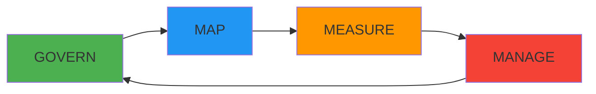

# NIST AI Risk Management Framework Guide

This guide covers how ComplianceAgent helps you implement the NIST AI Risk Management Framework (AI RMF).

## Overview

| Attribute | Value |
|-----------|-------|
| **Full Name** | NIST AI Risk Management Framework (AI RMF 1.0) |
| **Jurisdiction** | United States (voluntary, global adoption) |
| **Published** | January 26, 2023 |
| **Publisher** | National Institute of Standards and Technology |
| **Type** | Voluntary framework |
| **Updates** | Companion Playbook, Profiles, Crosswalks available |

## Framework Structure

The AI RMF consists of two main parts:

### Part 1: Foundational Information

Describes how organizations can frame AI risks and understand the characteristics of trustworthy AI.

### Part 2: Core Functions

Four functions that form the lifecycle approach to AI risk management:



## Trustworthy AI Characteristics

| Characteristic | Description | Implementation |
|---------------|-------------|----------------|
| **Valid & Reliable** | AI performs as intended consistently | Testing, validation, monitoring |
| **Safe** | AI doesn't harm people or environment | Safety testing, guardrails |
| **Secure & Resilient** | Resistant to attacks and recovers | Security testing, redundancy |
| **Accountable & Transparent** | Clear responsibility and explainability | Audit trails, documentation |
| **Explainable & Interpretable** | Outputs can be understood | Explainability tools, logging |
| **Privacy-Enhanced** | Protects individual privacy | Data minimization, anonymization |
| **Fair (Bias Managed)** | Avoids discrimination | Bias testing, fairness metrics |

## Core Functions

### GOVERN

Cultivate a culture of risk management within the organization.

| Category | Subcategory | Implementation |
|----------|-------------|----------------|
| GV.1 | Policies and procedures | AI governance documentation |
| GV.2 | Accountability structures | Roles, responsibilities, oversight |
| GV.3 | Workforce diversity and training | AI ethics training, diverse teams |
| GV.4 | Stakeholder engagement | Impact assessments, feedback |
| GV.5 | Risk management integration | AI risks in enterprise risk |
| GV.6 | Policies for third-party AI | Vendor assessments, contracts |

### MAP

Understand the AI system context and identify risks.

| Category | Subcategory | Implementation |
|----------|-------------|----------------|
| MP.1 | Context established | Use case documentation |
| MP.2 | Categorization | Risk classification |
| MP.3 | Benefits and impacts | Impact assessments |
| MP.4 | Risks and impacts | Risk identification |
| MP.5 | Impacts to individuals | Privacy, fairness analysis |

### MEASURE

Analyze, assess, and track AI risks.

| Category | Subcategory | Implementation |
|----------|-------------|----------------|
| MS.1 | Appropriate methods | Validation approaches |
| MS.2 | AI systems evaluated | Testing and validation |
| MS.3 | Mechanisms for tracking | Monitoring and metrics |

### MANAGE

Prioritize and act on AI risks.

| Category | Subcategory | Implementation |
|----------|-------------|----------------|
| MG.1 | Risks prioritized | Risk ranking |
| MG.2 | Strategies to maximize benefits | Optimization |
| MG.3 | Risks managed | Mitigation actions |
| MG.4 | Risk treatments monitored | Ongoing assessment |

## ComplianceAgent Detection

### Automatically Detected Issues

```
NIST-AI-001: Missing model documentation
NIST-AI-002: No bias testing implemented
NIST-AI-003: Missing explainability mechanisms
NIST-AI-004: Inadequate model validation
NIST-AI-005: No performance monitoring
NIST-AI-006: Missing data quality checks
NIST-AI-007: No human oversight mechanism
NIST-AI-008: Inadequate security for AI models
NIST-AI-009: Missing privacy protections in training data
NIST-AI-010: No incident response for AI failures
```

### Example Detection

**Issue: NIST-AI-002 - No bias testing**

```python
# ❌ Non-compliant: Model deployed without bias testing
class LoanApprovalModel:
    def __init__(self):
        self.model = load_model("loan_model.pkl")
    
    def predict(self, applicant_data: dict) -> bool:
        # Direct prediction without bias checks
        return self.model.predict([applicant_data])[0]
```

**ComplianceAgent Fix:**

```python
# ✅ Compliant: Bias testing and fairness monitoring
from fairlearn.metrics import demographic_parity_difference, equalized_odds_difference
import structlog

logger = structlog.get_logger()

class LoanApprovalModel:
    def __init__(self):
        self.model = load_model("loan_model.pkl")
        self.bias_metrics = {}
        self.fairness_thresholds = {
            "demographic_parity": 0.1,
            "equalized_odds": 0.1,
        }
    
    def predict(self, applicant_data: dict) -> dict:
        prediction = self.model.predict([applicant_data])[0]
        confidence = self.model.predict_proba([applicant_data])[0].max()
        
        # NIST AI RMF: Log prediction for monitoring
        logger.info(
            "model_prediction",
            model_id="loan_approval_v1",
            prediction=bool(prediction),
            confidence=float(confidence),
            # Don't log protected attributes directly
            has_protected_attrs=self._has_protected_attrs(applicant_data),
        )
        
        return {
            "approved": bool(prediction),
            "confidence": float(confidence),
            "model_version": "v1.0",
            "explanation": self._generate_explanation(applicant_data),
        }
    
    def validate_fairness(self, test_data: pd.DataFrame, 
                         protected_attribute: str) -> dict:
        """NIST AI RMF MS.2: Evaluate AI system for bias."""
        
        predictions = self.model.predict(test_data.drop(columns=["target"]))
        actuals = test_data["target"]
        groups = test_data[protected_attribute]
        
        metrics = {
            "demographic_parity": demographic_parity_difference(
                actuals, predictions, sensitive_features=groups
            ),
            "equalized_odds": equalized_odds_difference(
                actuals, predictions, sensitive_features=groups
            ),
        }
        
        # Check against thresholds
        fairness_passed = all(
            abs(metrics[m]) <= self.fairness_thresholds[m]
            for m in metrics
        )
        
        logger.info(
            "bias_evaluation",
            model_id="loan_approval_v1",
            protected_attribute=protected_attribute,
            metrics=metrics,
            fairness_passed=fairness_passed,
        )
        
        if not fairness_passed:
            logger.warning(
                "bias_threshold_exceeded",
                model_id="loan_approval_v1",
                metrics=metrics,
                thresholds=self.fairness_thresholds,
            )
        
        return {
            "metrics": metrics,
            "passed": fairness_passed,
            "thresholds": self.fairness_thresholds,
        }
    
    def _generate_explanation(self, applicant_data: dict) -> dict:
        """NIST AI RMF: Explainability for transparency."""
        import shap
        
        explainer = shap.TreeExplainer(self.model)
        shap_values = explainer.shap_values([list(applicant_data.values())])
        
        feature_importance = dict(zip(
            applicant_data.keys(),
            shap_values[0].tolist()
        ))
        
        # Return top factors
        sorted_factors = sorted(
            feature_importance.items(),
            key=lambda x: abs(x[1]),
            reverse=True
        )[:5]
        
        return {
            "top_factors": dict(sorted_factors),
            "explanation_method": "SHAP",
        }
```

**Issue: NIST-AI-004 - Inadequate model validation**

```python
# ❌ Non-compliant: No validation before deployment
def deploy_model(model_path: str):
    model = load_model(model_path)
    production_endpoint.update(model)
    return {"status": "deployed"}
```

**ComplianceAgent Fix:**

```python
# ✅ Compliant: Comprehensive validation before deployment
from dataclasses import dataclass
from typing import Optional
import numpy as np

@dataclass
class ValidationResult:
    passed: bool
    accuracy: float
    precision: float
    recall: float
    f1_score: float
    bias_metrics: dict
    performance_degradation: Optional[float]
    validation_timestamp: str

class ModelValidator:
    def __init__(self):
        self.minimum_accuracy = 0.85
        self.max_performance_degradation = 0.05
        self.required_test_samples = 1000
    
    async def validate_for_deployment(
        self,
        model,
        validation_data: pd.DataFrame,
        current_production_model=None,
    ) -> ValidationResult:
        """NIST AI RMF MS.2: Comprehensive model validation."""
        
        # Basic performance metrics
        predictions = model.predict(validation_data.drop(columns=["target"]))
        actuals = validation_data["target"]
        
        from sklearn.metrics import accuracy_score, precision_score, recall_score, f1_score
        
        metrics = {
            "accuracy": accuracy_score(actuals, predictions),
            "precision": precision_score(actuals, predictions, average="weighted"),
            "recall": recall_score(actuals, predictions, average="weighted"),
            "f1_score": f1_score(actuals, predictions, average="weighted"),
        }
        
        # Check for performance degradation vs current model
        degradation = None
        if current_production_model:
            prod_predictions = current_production_model.predict(
                validation_data.drop(columns=["target"])
            )
            prod_accuracy = accuracy_score(actuals, prod_predictions)
            degradation = prod_accuracy - metrics["accuracy"]
        
        # Bias evaluation
        bias_metrics = self._evaluate_bias(model, validation_data)
        
        # Determine if validation passed
        passed = (
            metrics["accuracy"] >= self.minimum_accuracy
            and (degradation is None or degradation <= self.max_performance_degradation)
            and bias_metrics["passed"]
        )
        
        result = ValidationResult(
            passed=passed,
            accuracy=metrics["accuracy"],
            precision=metrics["precision"],
            recall=metrics["recall"],
            f1_score=metrics["f1_score"],
            bias_metrics=bias_metrics,
            performance_degradation=degradation,
            validation_timestamp=datetime.utcnow().isoformat(),
        )
        
        # Log validation results
        logger.info(
            "model_validation_complete",
            passed=passed,
            metrics=metrics,
            bias_passed=bias_metrics["passed"],
        )
        
        return result

async def deploy_model(model_path: str):
    """Deploy model only after validation passes."""
    model = load_model(model_path)
    current_model = production_endpoint.get_current_model()
    validation_data = load_validation_dataset()
    
    validator = ModelValidator()
    result = await validator.validate_for_deployment(
        model,
        validation_data,
        current_model,
    )
    
    if not result.passed:
        logger.error(
            "model_deployment_blocked",
            reason="validation_failed",
            result=result.__dict__,
        )
        raise ValidationError(f"Model failed validation: {result}")
    
    # Create deployment record for audit
    deployment_record = await create_deployment_record(
        model_path=model_path,
        validation_result=result,
        deployed_by=current_user.id,
    )
    
    production_endpoint.update(model)
    
    return {
        "status": "deployed",
        "deployment_id": deployment_record.id,
        "validation": result.__dict__,
    }
```

**Issue: NIST-AI-007 - No human oversight**

```python
# ❌ Non-compliant: Fully automated high-stakes decisions
@app.post("/api/loan/auto-approve")
async def auto_approve_loan(application: LoanApplication):
    result = loan_model.predict(application.dict())
    if result["approved"]:
        await process_loan(application)  # No human review
    return result
```

**ComplianceAgent Fix:**

```python
# ✅ Compliant: Human-in-the-loop for high-stakes decisions
from enum import Enum

class ReviewRequirement(Enum):
    NONE = "none"
    OPTIONAL = "optional"
    REQUIRED = "required"

class HumanOversightPolicy:
    def __init__(self):
        # NIST AI RMF GV.1: Policies for human oversight
        self.thresholds = {
            "low_confidence": 0.7,  # Below this, always require review
            "high_amount": 50000,   # Above this amount, require review
            "edge_case_flags": ["first_time_applicant", "unusual_income_pattern"],
        }
    
    def determine_review_requirement(
        self,
        prediction: dict,
        application: dict,
    ) -> ReviewRequirement:
        """Determine if human review is required."""
        
        # Always require review for low confidence
        if prediction["confidence"] < self.thresholds["low_confidence"]:
            return ReviewRequirement.REQUIRED
        
        # Require review for high-value decisions
        if application.get("loan_amount", 0) > self.thresholds["high_amount"]:
            return ReviewRequirement.REQUIRED
        
        # Require review for edge cases
        if any(
            flag in application.get("flags", [])
            for flag in self.thresholds["edge_case_flags"]
        ):
            return ReviewRequirement.REQUIRED
        
        # Denial decisions should be reviewable
        if not prediction["approved"]:
            return ReviewRequirement.OPTIONAL
        
        return ReviewRequirement.NONE

oversight_policy = HumanOversightPolicy()

@app.post("/api/loan/evaluate")
async def evaluate_loan(application: LoanApplication):
    """Evaluate loan with human oversight per NIST AI RMF."""
    
    prediction = loan_model.predict(application.dict())
    review_requirement = oversight_policy.determine_review_requirement(
        prediction,
        application.dict(),
    )
    
    response = {
        "prediction": prediction,
        "review_requirement": review_requirement.value,
        "can_auto_process": review_requirement == ReviewRequirement.NONE,
    }
    
    if review_requirement == ReviewRequirement.REQUIRED:
        # Create review task for human reviewer
        review_task = await create_review_task(
            application_id=application.id,
            prediction=prediction,
            reason="human_oversight_required",
            priority="normal" if prediction["confidence"] > 0.5 else "high",
        )
        response["review_task_id"] = review_task.id
        response["status"] = "pending_review"
        
        logger.info(
            "human_review_required",
            application_id=str(application.id),
            review_reason=review_requirement.value,
            confidence=prediction["confidence"],
        )
    elif review_requirement == ReviewRequirement.NONE and prediction["approved"]:
        # Auto-process only when no review required and approved
        await process_loan(application)
        response["status"] = "approved_auto"
    else:
        response["status"] = "pending_review"
    
    return response

@app.post("/api/loan/review/{task_id}")
@require_role(["loan_officer", "senior_reviewer"])
async def submit_review(
    task_id: str,
    review: ReviewDecision,
    current_user: User,
):
    """Human reviewer submits decision."""
    
    task = await get_review_task(task_id)
    
    # Record human decision with reasoning
    await record_review_decision(
        task_id=task_id,
        reviewer_id=current_user.id,
        decision=review.decision,
        reasoning=review.reasoning,
        ai_prediction=task.prediction,
        agreement_with_ai=review.decision == task.prediction["approved"],
    )
    
    if review.decision:
        await process_loan(task.application)
    
    logger.info(
        "human_review_completed",
        task_id=task_id,
        reviewer_id=str(current_user.id),
        decision=review.decision,
        agreed_with_ai=review.decision == task.prediction["approved"],
    )
    
    return {"status": "review_completed", "decision": review.decision}
```

## Model Documentation Template

```python
# NIST AI RMF GOVERN: Model Card / System Documentation
MODEL_DOCUMENTATION = {
    "model_details": {
        "name": "Loan Approval Model",
        "version": "1.0.0",
        "type": "Binary Classification",
        "framework": "scikit-learn",
        "created_date": "2024-01-15",
        "last_updated": "2024-01-20",
        "owner": "ML Team",
        "contact": "ml-team@company.com",
    },
    "intended_use": {
        "primary_use": "Assist loan officers in evaluating loan applications",
        "primary_users": "Loan officers, underwriters",
        "out_of_scope": [
            "Fully automated loan decisions without human review",
            "Use for credit scoring in other contexts",
        ],
    },
    "training_data": {
        "description": "Historical loan application data 2020-2023",
        "size": "500,000 applications",
        "features": ["income", "debt_ratio", "employment_length", "..."],
        "label": "loan_repaid (binary)",
        "data_quality_checks": ["missing_values", "outliers", "consistency"],
        "privacy_measures": ["anonymization", "differential_privacy"],
    },
    "evaluation": {
        "metrics": {
            "accuracy": 0.87,
            "precision": 0.85,
            "recall": 0.89,
            "f1_score": 0.87,
            "auc_roc": 0.92,
        },
        "fairness_metrics": {
            "demographic_parity_gender": 0.03,
            "equalized_odds_gender": 0.05,
            "demographic_parity_age": 0.04,
        },
        "test_dataset": "20% holdout, stratified",
    },
    "ethical_considerations": {
        "potential_harms": [
            "Disparate impact on protected groups",
            "Over-reliance on automated decisions",
        ],
        "mitigations": [
            "Regular bias audits",
            "Human-in-the-loop for all decisions",
            "Appeal process for applicants",
        ],
    },
    "limitations": [
        "Performance may degrade for applicants outside training distribution",
        "Does not account for recent economic changes",
        "Limited validation for self-employed applicants",
    ],
    "monitoring": {
        "metrics_tracked": ["accuracy", "fairness_metrics", "prediction_distribution"],
        "alert_thresholds": {"accuracy_drop": 0.05, "bias_increase": 0.02},
        "review_frequency": "monthly",
    },
}
```

## SDK Integration

```python
from complianceagent import configure, ai_rmf_governed, bias_check, explainable

configure(regulations=["NIST-AI-RMF"])

# Governance wrapper
@ai_rmf_governed(
    model_id="loan_model_v1",
    risk_level="high",
    human_oversight="required",
)
async def evaluate_application(data: dict):
    return model.predict(data)

# Automatic bias checking
@bias_check(
    protected_attributes=["gender", "age", "race"],
    threshold=0.1,
)
async def batch_predictions(data: pd.DataFrame):
    return model.predict(data)

# Explainability wrapper
@explainable(method="shap", top_features=5)
async def get_prediction_with_explanation(data: dict):
    return model.predict(data)
```

## Compliance Dashboard

```
Dashboard → Compliance → NIST AI RMF

┌─────────────────────────────────────────────────────────┐
│ NIST AI RMF Compliance Status                           │
├─────────────────────────────────────────────────────────┤
│ Overall Maturity: Level 3 (Defined)                     │
│                                                         │
│ GOVERN:                                                 │
│   Policies & Procedures:   ✅ Documented                │
│   Accountability:          ✅ Defined                   │
│   Training:                ✅ 95% completion            │
│   Third-party AI:          ✅ Assessment process        │
│                                                         │
│ MAP:                                                    │
│   AI Inventory:            12 models cataloged          │
│   Risk Assessments:        ✅ All models assessed       │
│   Impact Assessments:      ✅ High-risk complete        │
│                                                         │
│ MEASURE:                                                │
│   Validation Coverage:     ✅ 100%                      │
│   Bias Testing:            ✅ Monthly                   │
│   Performance Monitoring:  ✅ Real-time                 │
│                                                         │
│ MANAGE:                                                 │
│   Risk Treatments:         3 active                     │
│   Incidents (30 days):     1 (resolved)                │
│   Model Updates:           2 pending review            │
└─────────────────────────────────────────────────────────┘
```

## Resources

- [NIST AI RMF 1.0](https://www.nist.gov/itl/ai-risk-management-framework)
- [AI RMF Playbook](https://airc.nist.gov/AI_RMF_Knowledge_Base/Playbook)
- [NIST AI RMF Profiles](https://airc.nist.gov/AI_RMF_Knowledge_Base/Profiles)
- [Crosswalks to Other Frameworks](https://airc.nist.gov/AI_RMF_Knowledge_Base/Crosswalks)

## Related Documentation

- [EU AI Act Compliance](eu-ai-act.md)
- [ISO 42001 Compliance](iso42001.md)
- [Security Best Practices](../guides/security.md)
