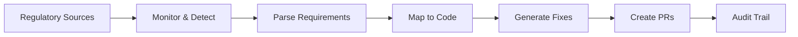
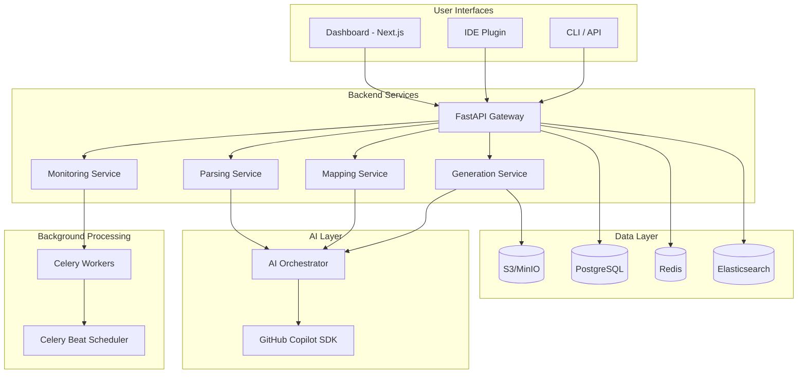

# ComplianceAgent Documentation

Welcome to the ComplianceAgent documentation hub. This guide covers everything you need to know to use, develop, and deploy ComplianceAgent.

## What is ComplianceAgent?

ComplianceAgent is an AI-powered platform that transforms regulatory compliance from a reactive burden into a proactive, automated workflow. It automatically:

- **Monitors** 100+ regulatory sources (GDPR, CCPA, EU AI Act, HIPAA, etc.)
- **Parses** legal text using the GitHub Copilot SDK to extract actionable requirements
- **Maps** requirements to specific code locations in your repositories
- **Generates** compliant code modifications with full audit trails
- **Tracks** compliance status across your entire organization



---

## Quick Navigation

### 🚀 Getting Started

| Guide | Description |
|-------|-------------|
| [Quick Start](guides/getting-started.md) | Set up and run ComplianceAgent in 5 minutes |
| [Development Setup](guides/getting-started.md#development-setup) | Configure your local development environment |
| [First Analysis](guides/getting-started.md#your-first-compliance-analysis) | Run your first compliance analysis |

### 📚 Core Documentation

| Document | Description |
|----------|-------------|
| [Architecture Overview](architecture/overview.md) | System design, components, and data flow |
| [API Reference](api/reference.md) | Complete REST API documentation |
| [SDK Reference](api/sdk.md) | Python and TypeScript SDK documentation |

### 🔧 Guides

| Guide | Description |
|-------|-------------|
| [Deployment Guide](deployment/README.md) | Deploy to Docker, AWS, or Kubernetes |
| [Configuration Reference](guides/configuration.md) | Environment variables and settings |
| [CI/CD Integration](guides/cicd-integration.md) | GitHub Actions compliance gates |
| [Security Best Practices](guides/security.md) | Security guidelines and implementation |
| [Troubleshooting](guides/troubleshooting.md) | Common issues and solutions |
| [Operations Runbook](guides/runbook.md) | Production operations procedures |

### 🧑‍💻 Development

| Guide | Description |
|-------|-------------|
| [Contributing](../CONTRIBUTING.md) | How to contribute to ComplianceAgent |
| [Development Overview](development/README.md) | Complete development setup guide |
| [Backend Development](development/backend.md) | Python/FastAPI development guide |
| [Frontend Development](development/frontend.md) | Next.js/React development guide |
| [Testing Guide](development/testing.md) | Testing strategies and tools |
| [IDE Extension](../ide-extension/README.md) | VS Code extension development |
| [ADR Template](architecture/adr-template.md) | Architecture Decision Records |

---

## Architecture at a Glance



---

## Key Features by Role

### For Developers

- **Real-time compliance hints** in your IDE
- **Automated PR creation** with compliant code fixes
- **CI/CD gates** that block non-compliant code
- **Compliance-as-Code templates** for common patterns

### For Compliance Teams

- **Real-time dashboard** showing compliance status
- **Regulatory alerts** when requirements change
- **Audit reports** with tamper-proof verification
- **Evidence collection** for SOC 2, ISO 27001, etc.

### For Engineering Managers

- **Risk visibility** across all repositories
- **Effort estimates** for compliance work
- **Progress tracking** on remediation
- **Multi-jurisdiction** conflict resolution

---

## Supported Frameworks

### Privacy & Data Protection

| Framework | Jurisdiction | Documentation |
|-----------|--------------|---------------|
| GDPR | EU | [Guide](frameworks/gdpr.md) |
| CCPA/CPRA | US-California | [Guide](frameworks/ccpa.md) |
| HIPAA | US-Federal | [Guide](frameworks/hipaa.md) |
| PIPL | China | [Guide](frameworks/pipl.md) |

### Security & Compliance

| Framework | Jurisdiction | Documentation |
|-----------|--------------|---------------|
| PCI-DSS v4.0 | Global | [Guide](frameworks/pci-dss.md) |
| SOC 2 | Global | [Guide](frameworks/soc2.md) |
| ISO 27001:2022 | Global | [Guide](frameworks/iso27001.md) |
| NIS2 | EU | [Guide](frameworks/nis2.md) |

### Financial

| Framework | Jurisdiction | Documentation |
|-----------|--------------|---------------|
| GLBA | US-Federal | [Guide](frameworks/glba.md) |

### Education

| Framework | Jurisdiction | Documentation |
|-----------|--------------|---------------|
| FERPA | US-Federal | [Guide](frameworks/ferpa.md) |

### AI Regulation

| Framework | Jurisdiction | Documentation |
|-----------|--------------|---------------|
| EU AI Act | EU | [Guide](frameworks/eu-ai-act.md) |
| NIST AI RMF | US-Federal | [Guide](frameworks/nist-ai-rmf.md) |
| ISO 42001 | Global | [Guide](frameworks/iso42001.md) |

---

## API Quick Reference

### Authentication

```bash
# Register
curl -X POST /api/v1/auth/register \
  -d '{"email": "user@example.com", "password": "...", "full_name": "..."}'

# Login
curl -X POST /api/v1/auth/login \
  -d '{"email": "user@example.com", "password": "..."}'
```

### Compliance Operations

```bash
# Check compliance status
curl -H "Authorization: Bearer $TOKEN" \
  /api/v1/compliance/status

# Trigger repository analysis
curl -X POST -H "Authorization: Bearer $TOKEN" \
  /api/v1/repositories/{id}/analyze \
  -d '{"frameworks": ["gdpr", "ccpa"]}'

# Generate compliant code
curl -X POST -H "Authorization: Bearer $TOKEN" \
  /api/v1/compliance/generate \
  -d '{"mapping_id": "uuid"}'
```

[Full API Reference →](api/reference.md)

---

## Common Tasks

### Analyze a New Repository

1. Add repository via API or dashboard
2. Configure applicable frameworks
3. Trigger initial analysis
4. Review compliance gaps
5. Generate fixes or create manual PRs

### Respond to Regulatory Change

1. System detects change automatically
2. Requirements are extracted and mapped
3. Affected repositories are identified
4. Review impact assessment
5. Approve generated fixes

### Generate Compliance Evidence

1. Navigate to Audit section
2. Select date range and frameworks
3. Export report (PDF, JSON, or CSV)
4. Verify hash chain integrity

---

## Getting Help

- **Documentation**: You're here! Browse the guides above.
- **GitHub Issues**: [Report bugs or request features](https://github.com/josedab/complianceagent/issues)
- **Discussions**: [Ask questions and share ideas](https://github.com/josedab/complianceagent/discussions)
- **Email**: contact@complianceagent.ai

---

## Version Information

| Component | Version |
|-----------|---------|
| Backend API | 1.0.0 |
| Frontend | 1.0.0 |
| API Version | v1 |
| Python | 3.12+ |
| Node.js | 20+ |

See the [Changelog](../CHANGELOG.md) for release history.
