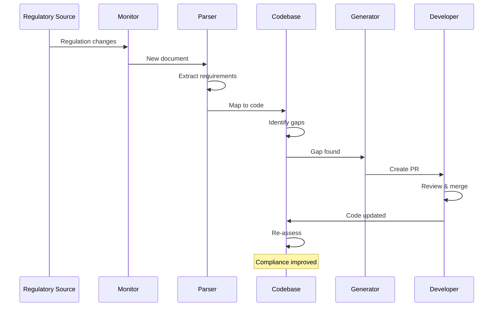

# Core Concepts Overview

ComplianceAgent automates the entire compliance lifecycle through five interconnected systems. This page explains how they work together.

## The Compliance Challenge

Traditional compliance is painful:

1. **Manual monitoring** - Lawyers track regulatory changes across dozens of sources
2. **Expert interpretation** - Legal teams translate requirements into technical specs
3. **Engineering implementation** - Developers implement changes without compliance context
4. **Audit preparation** - Scrambling to gather evidence before audits
5. **Repeat** - Start over when regulations change

This process is slow, expensive, and error-prone.

## The ComplianceAgent Approach

ComplianceAgent automates each step:

```
┌─────────────────────────────────────────────────────────────────────┐
│                    ComplianceAgent Pipeline                         │
├─────────────────────────────────────────────────────────────────────┤
│                                                                     │
│   ┌──────────┐    ┌──────────┐    ┌──────────┐    ┌──────────┐    │
│   │ Monitor  │───▶│  Parse   │───▶│   Map    │───▶│ Generate │    │
│   │          │    │          │    │          │    │          │    │
│   │ Track    │    │ Extract  │    │ Identify │    │ Create   │    │
│   │ 100+     │    │ require- │    │ affected │    │ compliant│    │
│   │ sources  │    │ ments    │    │ code     │    │ code     │    │
│   └──────────┘    └──────────┘    └──────────┘    └──────────┘    │
│        │                                               │           │
│        │         ┌──────────────────────┐              │           │
│        └────────▶│    Audit Trail       │◀─────────────┘           │
│                  │  Every action logged │                          │
│                  └──────────────────────┘                          │
│                                                                     │
└─────────────────────────────────────────────────────────────────────┘
```

## Five Core Systems

### 1. Regulatory Monitoring

ComplianceAgent continuously monitors regulatory sources worldwide:

- **100+ official sources** - EUR-Lex, Federal Register, national DPAs
- **Real-time change detection** - Know within hours when regulations change
- **Predictive intelligence** - ML-powered 6-12 month advance warnings

[Learn more about Regulatory Monitoring →](./regulatory-monitoring)

### 2. AI-Powered Parsing

Legal text is transformed into structured, actionable requirements:

- **Obligation extraction** - Identifies MUST, SHOULD, MAY requirements
- **Entity recognition** - Detects data types, roles, and timeframes
- **Confidence scoring** - Indicates parsing certainty
- **Citation tracking** - Links requirements to source articles

[Learn more about AI Parsing →](./ai-parsing)

### 3. Codebase Mapping

Requirements are automatically mapped to your code:

- **Repository analysis** - Scans your connected repositories
- **Pattern detection** - Identifies relevant code patterns
- **Gap identification** - Highlights where code doesn't meet requirements
- **Impact assessment** - Shows which code is affected by changes

[Learn more about Codebase Mapping →](./codebase-mapping)

### 4. Code Generation

ComplianceAgent suggests and generates compliant code:

- **Context-aware suggestions** - Understands your codebase style
- **PR creation** - Opens pull requests with fixes
- **Documentation** - Explains why changes are needed
- **Multi-language support** - Python, TypeScript, Java, Go, and more

[Learn more about Code Generation →](./code-generation)

### 5. Multi-Jurisdiction Handling

Real-world compliance spans multiple regions:

- **Conflict detection** - Identifies conflicting requirements
- **Resolution strategies** - Configurable approaches (strictest, origin-based)
- **Regional customization** - Adapt to local requirements

[Learn more about Multi-Jurisdiction →](./multi-jurisdiction)

## Key Entities

Understanding these entities helps you navigate ComplianceAgent:

### Organization

The top-level container for your compliance data. Organizations contain:
- Team members and their roles
- Connected repositories
- Enabled regulatory frameworks
- Billing and subscription info

### Regulation

A regulatory framework like GDPR, HIPAA, or PCI-DSS. Each regulation contains:
- **Metadata** - Name, jurisdiction, effective date
- **Requirements** - Extracted obligations
- **Sources** - Official documents and URLs

### Requirement

A specific compliance obligation extracted from a regulation:

```json
{
  "id": "gdpr-art-17-1",
  "text": "The data subject shall have the right to obtain erasure of personal data",
  "obligation_type": "MUST",
  "category": "data_subject_rights",
  "source_article": "Article 17(1)",
  "confidence": 0.95
}
```

### Repository

A connected code repository (typically from GitHub):
- **Analysis results** - Compliance mappings and gaps
- **Compliance status** - Per-framework scores
- **Action history** - Generated fixes and PRs

### Mapping

A connection between a requirement and code:

```json
{
  "requirement_id": "gdpr-art-17-1",
  "repository_id": "acme/backend",
  "file_path": "src/api/users.py",
  "line_range": [45, 67],
  "status": "gap",
  "confidence": 0.87
}
```

### Compliance Action

A suggested or completed fix:
- **Pending** - Suggested but not acted on
- **In Progress** - PR created, awaiting review
- **Completed** - Merged and deployed
- **Dismissed** - Marked as not applicable

## How It Fits Together

Here's a typical compliance workflow:



### Example: GDPR Right to Erasure

1. **Monitor** detects GDPR guidance update on EUR-Lex
2. **Parser** extracts requirement: "Users can request data deletion"
3. **Mapper** scans your code, finds `UserController.delete()` is incomplete
4. **Generator** creates a PR adding proper data erasure logic
5. **Developer** reviews and merges
6. **Audit trail** records the entire process

## Data Flow

```
┌─────────────────────────────────────────────────────────────────┐
│                        Data Flow                                 │
├─────────────────────────────────────────────────────────────────┤
│                                                                  │
│  Regulatory Sources        ComplianceAgent         Your Code    │
│  ─────────────────        ───────────────         ─────────    │
│                                                                  │
│  ┌─────────────┐         ┌─────────────┐        ┌───────────┐  │
│  │  EUR-Lex    │────────▶│  PostgreSQL │◀──────▶│  GitHub   │  │
│  │  EDPB       │  crawl  │  (primary)  │  API   │  Repos    │  │
│  │  Fed Reg    │         └─────────────┘        └───────────┘  │
│  │  ...100+    │                │                              │
│  └─────────────┘                │                              │
│                                 ▼                              │
│                         ┌─────────────┐                        │
│                         │Elasticsearch│                        │
│                         │  (search)   │                        │
│                         └─────────────┘                        │
│                                 │                              │
│                                 ▼                              │
│                         ┌─────────────┐                        │
│                         │   Redis     │                        │
│                         │(cache/queue)│                        │
│                         └─────────────┘                        │
│                                                                  │
└─────────────────────────────────────────────────────────────────┘
```

## Security Model

ComplianceAgent takes security seriously:

- **Data isolation** - Organizations are fully isolated (multi-tenant)
- **Encryption at rest** - All sensitive data encrypted
- **Encryption in transit** - TLS everywhere
- **Audit logging** - Tamper-proof hash chain
- **Access control** - Role-based permissions
- **API security** - JWT authentication, rate limiting

## Next Steps

Dive deeper into each system:

1. **[Regulatory Monitoring](./regulatory-monitoring)** - How regulations are tracked
2. **[AI Parsing](./ai-parsing)** - How legal text becomes requirements
3. **[Codebase Mapping](./codebase-mapping)** - How code is analyzed
4. **[Code Generation](./code-generation)** - How fixes are created
5. **[Multi-Jurisdiction](./multi-jurisdiction)** - Handling global compliance
